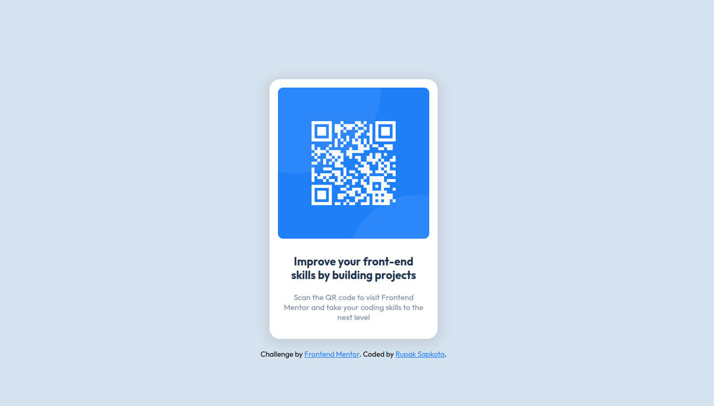

# Frontend Mentor - QR code component solution

This is a solution to the [QR code component challenge on Frontend Mentor](https://www.frontendmentor.io/challenges/qr-code-component-iux_sIO_H). Frontend Mentor challenges help you improve your coding skills by building realistic projects.

## Table of contents

- [Frontend Mentor - QR code component solution](#frontend-mentor---qr-code-component-solution)
  - [Table of contents](#table-of-contents)
  - [Overview](#overview)
    - [Screenshot](#screenshot)
    - [Links](#links)
  - [My process](#my-process)
    - [Built with](#built-with)
    - [What I learned](#what-i-learned)
  - [Author](#author)


## Overview

### Screenshot



### Links

- Solution URL: [Add solution URL here](https://your-solution-url.com)
- Live Site URL: [Add live site URL here](https://your-live-site-url.com)

## My process

### Built with

- Semantic HTML5 markup
- CSS custom properties
- Flexbox
- [React](https://reactjs.org/) - JS library
- [Styled Components](https://styled-components.com/) - For styles


### What I learned

Styled-components is a great tool for styling components. I learned how to use it, how to use it with React, how to create GlobalStyles, how to separate the styles in different files.

```js
const Title = style.div`
font-weight: 700;
font-size: 21px;
line-height: 26px;
color: var(--dark-blue);
`
```
```html
<Title>Improve your front-end skills by building projects</Title>
```


## Author

- Github - [Rupak Sapkota](https://www.gitub.com/RupakSapkota123)
- Frontend Mentor - [@yourusername](https://www.frontendmentor.io/profile/RupakSapkota123)


